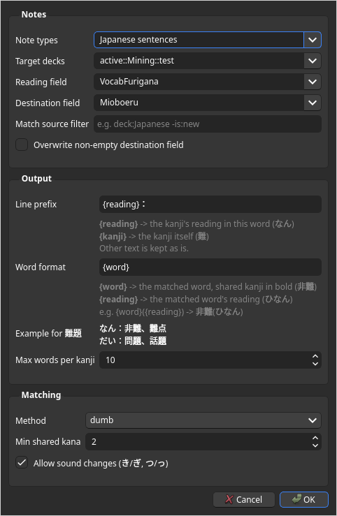

# Mioboeru (見覚える)

Anki add-on that links vocabulary notes sharing a kanji **with the same reading**.
I find it's easier to remember how to read a new word, if I know an existing word using the same kanji with the same reading. This plugin is designed to find those words, and add them to your card.

Targets Anki 25.02.7 (Python 3.9) ((since I refuce to upgrade my Anki version)). Built on [ajt_common](https://github.com/Ajatt-Tools/ajt_common)
and shows up in the AJT menu next to the other Ajatt-Tools add-ons.

## Example

Target word: **問題** (もんだい)

```
もん：学問、不問、質問、疑問、尋問、拷問、難問
だい：出題、議題、主題、課題、宿題、飲み放題、話題、本題、命題、難題
もんだい：問題集
```

- One line per kanji, starting with how that kanji is read in the target word.
- On the card, the shared kanji is bold: 学**問**、不**問**、質**問**...
- Words that contain the whole target word (問題集) get their own line with the full reading.
- Both the line prefix and the word format are configurable, e.g. `{word}({reading})` gives
  部**分**(ぶぶん)、半**分**(はんぶん).

## Setup in Anki

**Before you start:** your notes need a field that already has the word with its reading in
Anki's furigana format, e.g. `宿題[しゅくだい]`. Mioboeru reads this field but doesn't create it.
See [What your cards need](#what-your-cards-need) for the accepted formats.

1. **Install the add-on** and restart Anki.

2. **Add a field for the results.** Go to Tools > Manage Note Types, select your vocabulary
   note type, click Fields..., then Add, and name it e.g. `Mioboeru`. Mioboeru only writes to this
   field, so your existing fields are never touched.

3. **Show it on your cards (optional).** In Cards..., add `{{Mioboeru}}` to the back template.

4. **Configure it.** Open AJT > Mioboeru > Options and set:

   - **Note types**: your vocabulary note type.
   - **Target decks**: the decks to fill when running a bulk fill. Start with a small deck.
   - **Reading field**: the field with the word and its furigana, e.g. `宿題[しゅくだい]`
     (required, see [What your cards need](#what-your-cards-need)).
   - **Destination field**: the field you added in step 2.

   

5. **Try it on one card.** In the browser or the Edit window, click the **読** button in the
   editor toolbar. It fills the current note only.

6. **Fill a whole deck.** When you're happy with the results, run
   AJT > Mioboeru > Fill related words (target decks). To fill specific notes instead,
   select them in the browser and use Edit > Mioboeru: Fill related words (selected notes).

Every fill can be undone with Edit > Undo. Matches are searched in all decks of your note
types; use **Match source filter** (e.g. `-is:new`) to only list words you've already studied.

## How matching works

Mioboeru doesn't use a dictionary. Your cards only store whole-word readings (`問題[もんだい]`),
so it works out each kanji's reading by comparing words against each other. This is the `dumb`
method in Options; a dictionary-based method may be added later.

### What your cards need

Mioboeru doesn't generate readings itself: the **Reading field** must already contain the word
with its reading, written in Anki's furigana format, `word[reading]`. If you don't have such a
field yet, the [AJT Japanese](https://github.com/Ajatt-Tools/japanese) add-on can generate one.

| Field contents | Read as |
|---|---|
| `宿題[しゅくだい]` | 宿題 = しゅくだい |
| `宿[しゅく]題[だい]` or `宿[しゅく] 題[だい]` | 宿題 = しゅくだい |
| ` 一人暮[ひとりぐ]らし` | 一人暮らし = ひとりぐらし (kana outside the brackets is kept) |
| `お 茶[ちゃ]` | お茶 = おちゃ |
| `宿題[シュクダイ]` | katakana readings are converted to hiragana |
| `<b>宿題[しゅくだい]</b>` | formatting (HTML) is ignored |
| `ビール` | kana-only words are fine as they are |

Notes whose reading field can't be read are skipped: no brackets at all (`宿題`), other
brackets (`宿題（しゅくだい）`), or extra data inside them (`宿題[しゅくだい;a,h]`). Keep one word
per field: `宿題[しゅくだい]、問題[もんだい]` would be read as a single word.

### Matching steps

**1. Edge kanji only.** A kanji is compared when it's the first or last kanji of both words.
Kana around the kanji (お茶, 暮らし) is set aside first. If the kanji is first, the starts of the
two readings must agree; if it's last, the ends must agree:

| Target | Other word | Shared | Result |
|---|---|---|---|
| 宿題 しゅく**だい** | 問題 もん**だい** | 題 = だい | match |
| **しゅく**だい 宿題 | **しゅく**はく 宿泊 | 宿 = しゅく | match |
| 問題 もん**だい** | 題名 **だい**めい | 題 = だい | match (last in one, first in the other) |
| 時間 じかん | 人間 にんげん | only ん | no match |
| 毎日 まいにち | 今日 きょう | nothing | no match |

A kanji in the middle of a word with 3+ kanji can't be placed from readings alone, so it isn't
matched.

**2. Minimum shared reading.** The readings must share at least **Min shared kana** (default 2)
kana. That stops coincidences like 時間/人間 sharing only ん, but also misses one-kana readings
like 天気/元気 (き). A single-kanji card is the exception: 気[き] is exactly the kanji's reading,
so it always counts.

**3. Sound changes.** With **Allow sound changes** on, readings that change where two kanji
meet still count as the same:

- voicing: 日本 に**ほん** and 三本 さん**ぼん**
- small っ: 学生 **がく**せい and 学校 **がっ**こう, 一日 **いち**にち and 一歩 **いっ**ぽ

This is only allowed at the edge that touches the next kanji, so a different reading at the
start or end of a word still doesn't match.

**4. Impossible splits are rejected.** A kanji's reading never starts with ん, っ, ー or a small
kana (ゃ, ゅ, ょ...), so splits like that are skipped.

**5. Shared runs.** If both words share more than one kanji in a row, like 問題 and 問題集, the
reading of 問 alone can't be told apart from 題. Instead, the shared part is matched as a whole
and gets its own line with the shared part in bold:

```
もんだい：問題集
```

This also covers the other direction (問題集 as the target finds 問題), shared endings
(学生 in 大学生), partial runs (日本 in 日本人 and 日本語) and runs in the middle (問題 in
大問題集). These matches are valuable on their own: you may know 問題 without having noticed
it inside 問題集.

**6. Agreed reading.** Sometimes a pair of words agrees on too much: 学生 (がくせい) and 学説
(がくせつ) both start with がくせ, because せい and せつ start alike. When other matches for the
same kanji agree on a shorter reading (学校, 大学 -> がく), the longer one is relabelled with it,
so 学説 shows up under `がく：`. A single short outlier can't override the majority.

### Limitations

- Kanji in the middle of 3+ kanji words aren't matched.
- With only one or two matches, there's little to compare, so the reading label can still be
  too long. Raising Min shared kana trades fewer wrong matches for fewer matches overall.

## Development

```bash
git submodule update --init      # fetch mioboeru/ajt_common
./scripts/fetch_anki_docs.sh     # optional: offline Anki add-on docs
hatch run dev:test
hatch run dev:format             # isort + black
./scripts/package.sh             # -> ajt_mioboeru.ankiaddon
```

